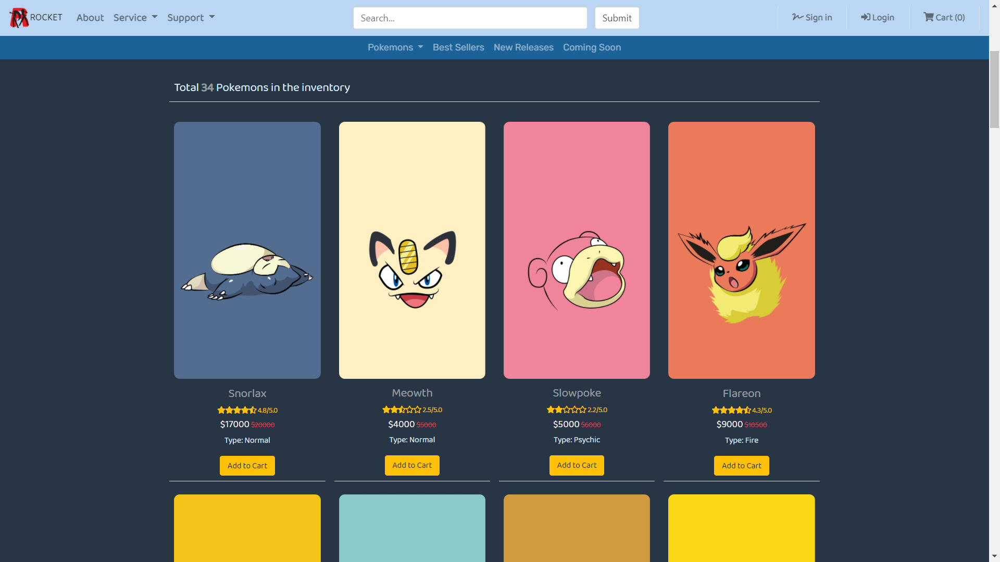

# Pokemon-Shop
This is an academic web project developed in team at Algonquin College.

To see RESTful Java Web version of this project, please visit [Pokemon Shop Spring project](https://github.com/wontaekoh/Pokemon-Shop-Spring).

**Features:**
- Product upload on MySQL database and read all products from it
- Product search by its name and type

**Future Tasks:**
- Complete CRUD operation using PHP

 

### Project Demonstration: 
Click the image below to watch the project demo
  

 

### References:
Images: https://shey.tistory.com/category/Wallpapers/%ED%8F%AC%EC%BC%93%EB%AA%AC%EC%8A%A4%ED%84%B0?page=2

Pokemon Descriptions: https://bulbapedia.bulbagarden.net/wiki/List_of_Pok%C3%A9mon_by_National_Pok%C3%A9dex_number
